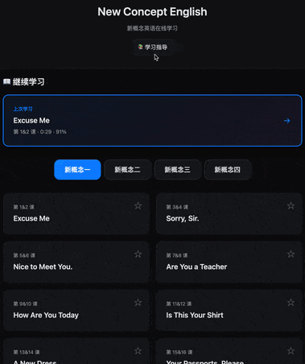

# NCE - 新概念英语在线学习平台

一个现代化的新概念英语在线点读应用，提供流畅的学习体验和丰富的功能。

## 🎉 演示地址

[https://wxaiway.com/nce/](https://wxaiway.com/nce/)



## ✨ 核心特性

### 📖 课文学习
- 🎨 **现代 UI 设计**: Apple 风格界面，深浅色主题自适应
- 📖 **句子级点读**: 精确到每个句子的音频播放
- 🎯 **多种学习模式**: 点读、发音练习、标准学习、课程复习、连贯学习
- 🌐 **三种语言模式**: 英文、双语、中文自由切换
- ⌨️ **全局快捷键**: 空格、方向键等快捷操作
- 💾 **学习进度保存**: 自动记录学习位置和进度
- 📝 **课程讲解**: 支持 Markdown 格式的课程讲解内容

### 📚 单词练习
- 🎴 **卡片学习**: 翻卡式单词记忆，支持顺序/随机模式
- 📖 **浏览模式**: 快速浏览单词列表，支持音频播放
- 📝 **默写稿生成**: 自动生成可打印的默写练习稿，支持多份随机组合
- 🎯 **听写练习**: 在线/线下两种听写模式，自动批改和错词复习
- 📊 **学习统计**: 记录学习进度和正确率，支持历史记录查看

### 📱 移动端优化
- 📱 **完美响应式**: 适配桌面、平板、手机各种设备
- 🍎 **iOS 深度优化**: Safari 完美兼容，触摸体验优化
- 🔆 **屏幕常亮**: 播放/学习时自动保持屏幕常亮，防止熄屏

## 🚀 快速开始

```bash
# 克隆项目
git clone https://github.com/wxaiway/nce-web.git
cd nce-web

# 安装依赖并启动
npm install
npm run dev

# 访问 http://localhost:8080/nce/
```

> 详细的开发指南请查看 [CONTRIBUTING.md](CONTRIBUTING.md)
> 部署说明请查看 [DEPLOY.md](DEPLOY.md)

## 📖 主要功能

### 课文学习
- 句子级点读，5种播放模式（点读/发音练习/标准学习/课程复习/连贯学习）
- 播放速度可调（0.75x - 2.0x），自动保存设置
- 三种语言模式（EN/EN+CN/CN），自动高亮和滚动
- Markdown 格式课程讲解，学习进度自动保存

### 单词练习
- **卡片学习**: 翻卡式记忆，支持美音/英音，三级评价系统
- **浏览模式**: 快速浏览单词列表，词性筛选
- **默写稿**: 自动生成可打印练习稿，支持 PDF 导出和分享
- **听写练习**: 在线/线下两种模式，自动批改，错词复习
- **历史记录**: 自动保存练习记录，支持重新练习

### ⌨️ 快捷键

**课文学习**: `Space` 播放/暂停 | `R` 重播 | `→/←` 上下句 | `↑/↓` 音量 | `1-9` 跳转进度
**卡片学习**: `Space` 翻卡 | `1/2/3` 认识/模糊/不认识
**听写练习**: `Space` 重播 | `Enter` 下一个

> 完整快捷键列表请按 `?` 或 `H` 查看

### 📱 移动端优化

- 触摸优化、屏幕常亮（Android Chrome 84+、iOS Safari 18.4+）
- iOS 音频自动解锁、Safari 完美兼容
- 连贯学习、播放速度保持

## 🛠️ 技术栈

Vite 5.x + 原生 JavaScript (ES6 Modules) + 原生 CSS (模块化) + marked.js

**特点**: 零运行时依赖、模块化设计、Apple 风格 UI

## 🐛 常见问题

### iOS Safari 音频无法播放

项目已内置 iOS 音频解锁功能，会在用户首次交互时自动解锁。听写模式下，点击"开始听写"按钮即可自动解锁音频播放。

### 如何切换语言模式？

点击页面右上角的语言切换按钮（EN / EN+CN / CN），设置会自动保存。

### 学习进度会保存吗？

会的。系统会自动保存您的学习位置、进度百分比和学习时长，下次打开会自动恢复。

### 播放速度会保持吗？

会的。系统会自动保存您设置的播放速度，切换课程时会自动恢复到您设置的速度。

### 支持哪些浏览器？

支持所有现代浏览器：Chrome、Firefox、Safari、Edge 等。移动端完美支持 iOS Safari 和 Android Chrome。

## 📄 许可证

MIT License

## 🙏 致谢

本项目基于 [NCE-Flow](https://github.com/luzhenhua/NCE-Flow) 重构，保留核心功能，优化代码架构。

## 📮 联系方式

- 项目地址: https://github.com/wxaiway/nce-web
- 问题反馈: https://github.com/wxaiway/nce-web/issues
- 联系作者: wxaiway@qq.com
- 作者微信: LwxAiWay

---

**享受学习新概念英语的乐趣！** 🎉
